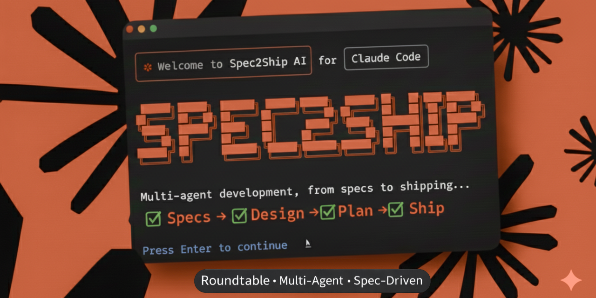

<p align="center">
  
</p>

# Spec2Ship (s2s)

AI-assisted development framework for the full software lifecycle — from specifications to shipping.

## Overview

Spec2Ship automates software development workflows using Claude Code:

- **Init**: Analyze and configure your project with smart detection
- **Brainstorm**: Creative ideation with multi-agent roundtables
- **Spec**: Define requirements through collaborative discussions
- **Design**: Create architecture with expert perspectives
- **Plan**: Generate and execute implementation plans

## Features

- **Smart Initialization**: Detects existing project structure and adapts accordingly
- **Roundtable Discussions**: 12 specialized AI agents with 5 facilitation strategies
- **Anti-Sycophancy**: Agents designed to disagree constructively
- **Creative Brainstorming**: Disney strategy (Dreamer → Realist → Critic)
- **Implementation Plans**: Structured plans with task tracking and git integration
- **Session Persistence**: Resume discussions anytime
- **Standards-Based**: Templates based on arc42, ISO 25010, MADR

## Installation

```bash
# Add marketplace
/plugin marketplace add spec2ship/spec2ship

# Install plugin
/plugin install s2s
```

## Workflow

```
┌──────────────┐     ┌──────────────┐     ┌──────────┐
│     init     │ ──► │  brainstorm  │ ──► │   specs  │
│              │     │  (optional)  │     │          │
│ Analyze &    │     │ Creative     │     │ Define   │
│ configure    │     │ ideation     │     │ what     │
└──────────────┘     └──────────────┘     └──────────┘
                                                │
              ┌─────────────────────────────────┘
              ▼
       ┌──────────────┐     ┌──────────────┐
       │    design    │ ──► │     plan     │
       │              │     │              │
       │ Architect    │     │ Generate &   │
       │ how          │     │ execute      │
       └──────────────┘     └──────────────┘
```

## Quick Start

```bash
# 1. Initialize your project
/s2s:init

# 2. (Optional) Brainstorm ideas
/s2s:brainstorm "new feature ideas"

# 3. Define specifications
/s2s:specs

# 4. Design architecture
/s2s:design

# 5. Generate implementation plans
/s2s:plan

# 6. Start working on a plan
/s2s:plan --session "plan-id"

# 7. Close the plan
/s2s:plan:close
```

## Commands

### Workflow Commands

| Command | Description |
|---------|-------------|
| `/s2s:init` | Initialize or update project (smart: detect → setup → context) |
| `/s2s:brainstorm "topic"` | Creative ideation with Disney strategy |
| `/s2s:specs` | Define requirements via roundtable |
| `/s2s:design` | Design architecture via roundtable |
| `/s2s:plan` | Generate implementation plans (smart) |

### Plan Sub-commands

| Command | Description |
|---------|-------------|
| `/s2s:plan` | Smart plan command with auto-detect |
| `/s2s:plan --new` | Create new implementation plan |
| `/s2s:plan --session "id"` | Resume specific plan |
| `/s2s:plan:list` | List all plans |
| `/s2s:plan:close` | Close current plan |

### Session Sub-commands

| Command | Description |
|---------|-------------|
| `/s2s:session` | Show current session status |
| `/s2s:session:list` | List all sessions |
| `/s2s:session:status [id]` | Detailed session info |
| `/s2s:session:close [id]` | Close a session |
| `/s2s:session:validate [id]` | Check session consistency |
| `/s2s:session:cleanup` | Remove old sessions |

### Roundtable Command

| Command | Description |
|---------|-------------|
| `/s2s:roundtable "topic"` | Start generic roundtable (auto-detects active) |
| `/s2s:roundtable "topic" --strategy disney` | With specific strategy |
| `/s2s:roundtable "topic" --participants arch,qa` | With specific participants |
| `/s2s:roundtable --session "id"` | Resume specific session |
| `/s2s:roundtable --new` | Force new session |

**Available flags for `roundtable`**:
- `--strategy <name>`: Facilitation strategy (standard, disney, debate, consensus-driven, six-hats)
- `--participants <list>`: Comma-separated participant IDs
- `--workflow-type <type>`: Workflow type (specs, design, brainstorm)
- `--output-type <type>`: Output format (adr, requirements, architecture, summary)

### Roundtable Strategies

| Strategy | Phases | Best For |
|----------|--------|----------|
| `standard` | 1 | General discussions |
| `disney` | 3 (dreamer, realist, critic) | Creative solutions |
| `debate` | 3 (opening, rebuttal, closing) | Option evaluation |
| `consensus-driven` | 3 | Fast decisions |
| `six-hats` | 7 | Comprehensive analysis |

## Re-running Init

The `/s2s:init` command is safe to re-run:

- **No changes detected**: Reports "Project is up to date"
- **New files detected**: Proposes updating CONTEXT.md
- **Major changes**: Offers to reinitialize with confirmation

## Documentation

- [Documentation Home](docs/README.md)
- [Getting Started](docs/getting-started.md)
- [Concepts](docs/concepts/)
- [Roundtable System](docs/roundtable/README.md)

For detailed guidance, ask Claude: "what commands does s2s have" or "how to extend s2s"

## License

MIT License - see [LICENSE](LICENSE)
