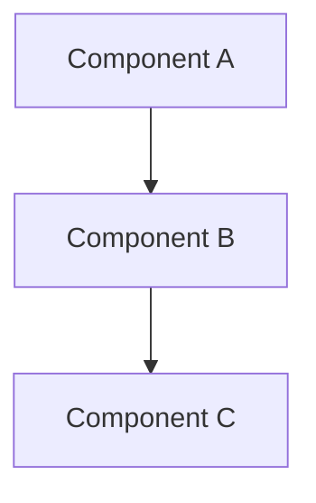

# Building Block View

<!--
Based on arc42 section 5: Building Block View.
Hierarchical decomposition of the system into building blocks.
-->

## Level 1: System Context

```
┌─────────────────────────────────────────────────────────┐
│                      {System Name}                       │
│                                                          │
│  ┌─────────────┐  ┌─────────────┐  ┌─────────────┐      │
│  │ Component A │  │ Component B │  │ Component C │      │
│  └─────────────┘  └─────────────┘  └─────────────┘      │
│                                                          │
└─────────────────────────────────────────────────────────┘
```

## Component Catalog

### Component A

| Aspect | Description |
|--------|-------------|
| **Purpose** | |
| **Responsibility** | |
| **Interfaces** | |
| **Dependencies** | |
| **Quality/Performance** | |

### Component B

| Aspect | Description |
|--------|-------------|
| **Purpose** | |
| **Responsibility** | |
| **Interfaces** | |
| **Dependencies** | |
| **Quality/Performance** | |

### Component C

| Aspect | Description |
|--------|-------------|
| **Purpose** | |
| **Responsibility** | |
| **Interfaces** | |
| **Dependencies** | |
| **Quality/Performance** | |

## Level 2: Component Details

<!--
For each major component, provide deeper decomposition if needed.
-->

### Component A - Internal Structure

```
┌─────────────────────────────────────┐
│          Component A                 │
│  ┌─────────┐  ┌─────────┐           │
│  │ Module 1│  │ Module 2│           │
│  └─────────┘  └─────────┘           │
└─────────────────────────────────────┘
```

## Cross-Cutting Concerns

| Concern | Approach |
|---------|----------|
| Logging | |
| Error Handling | |
| Security | |
| Configuration | |

## Dependencies



<!--
Or use a simple dependency matrix:

|              | Component A | Component B | Component C |
|--------------|-------------|-------------|-------------|
| Component A  | -           | uses        |             |
| Component B  |             | -           | uses        |
| Component C  |             |             | -           |
-->
